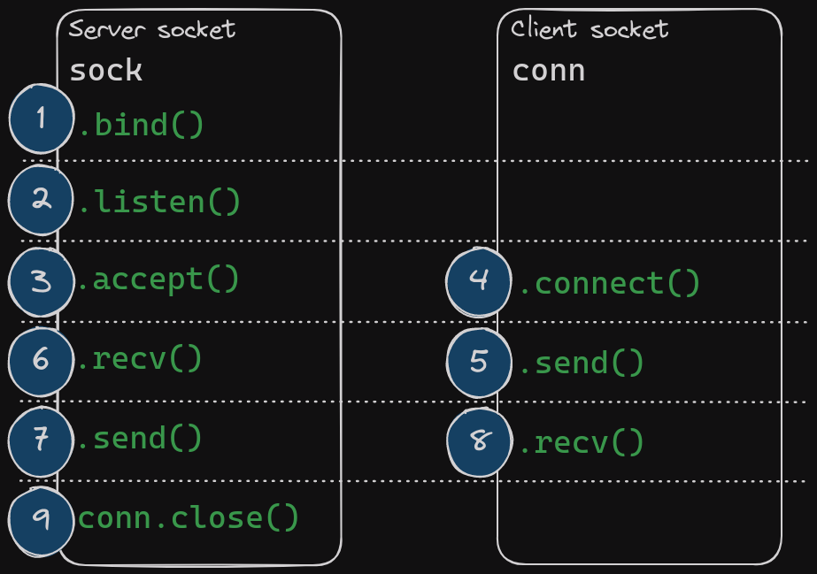
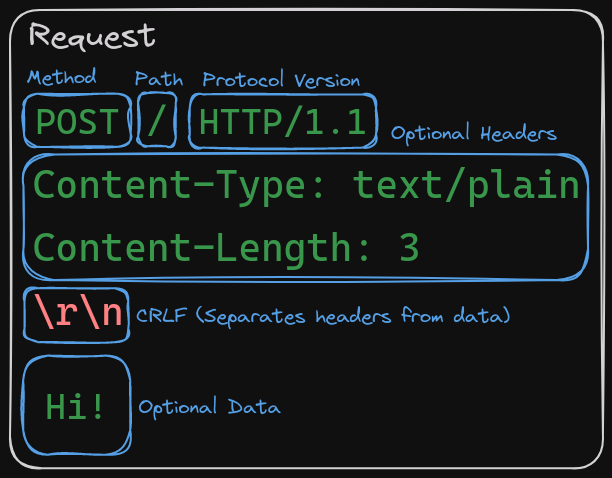
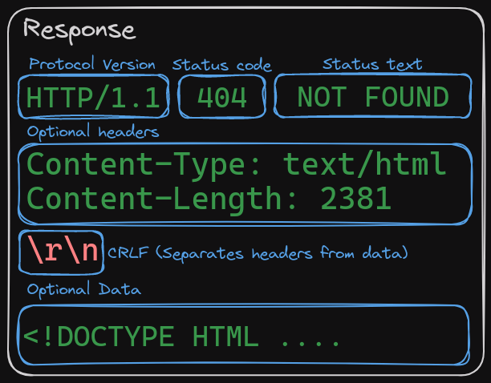
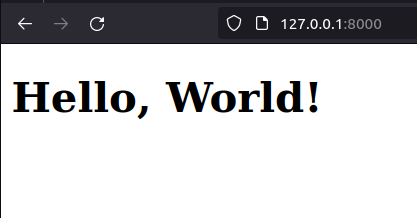

As any Backend Engineer, I recently lost it to my urge to build an HTTP server from scratch. Honestly, this is the perfect chance for me to start writing about technical stuff. Since you're already here, how about joining me? Come on, grab a drink, I'll be waiting :D

Ok. Here's how we're doing this. We're taking a top-down approach. We'll start with 1 line of code and try to get as close to "scratch" as we can. We'll do that by replacing the layers of abstraction (out-of-the-box code) with our custom code. While doing that, we were discussing some theory. 
I'll be using Python (I put "scratch" in double quotes, please don't kill me in my sleep, I promise it'll be fun!)

# Covered Concepts

* Berkeley sockets
* TCP connections
* HTTP Protocol
* Web servers
* Parsing and sending HTTP Messages

# Assumptions

1. We're working with HTTP/1.1.
1. No caching: The server won't handle caching.
1. One connection at a time: The server won't handle concurrent connections.
1. Short-lived connections: The server will end the connection once the files are transferred.
1. Only HEAD and GET: The server serves static files as-is!

# Sections

1. HTTP server with one line of code: Using `http.server`
1. Removing a layer of abstraction: Using `http.server.SimpleHTTPRequestHandler` and `socketserver.TCPServer`
1. Writing our custom TCP server (`PicoTCPServer`): Replacing `socketserver.TCPServer`
1. Writing our custom HTTP handler (`PicoHTTPRequestHandler`): Replacing `http.server.SimpleHTTPRequestHandler`
1. Finale!

# HTTP server with one line of code: Using `http.server`

Python has this ready out-of-the-box standard library that we can use to create our server: `http`. To create an HTTP server with `http.server` simply run this command: 

````bash
$ python -m http.server 8000  # i know, this isn't python code, shut up >:-(
# Serving HTTP on 0.0.0.0 port 8000 (http://0.0.0.0:8000/) ...
````

Now if you want to know what this does you can read [this](https://github.com/python/cpython/blob/d59feb5dbe5395615d06c30a95e6a6a9b7681d4d/Lib/http/server.py#L1280) (maybe after you finish this article cause we will talk about how that code works).

# Removing a layer of abstraction: Using `http.server.SimpleHTTPRequestHandler` and `socketserver.TCPServer`

Ok, we can officially start with this:
(please take a a quick look at the code :3 )

````python
#! /usr/bin/env python3

import http.server
import socketserver
import logging

# ===== Logging =====
logging.basicConfig(
    level=logging.INFO
)

logger = logging.getLogger(
    'http-server'
)

# ===== Logic =======
handler = http.server.SimpleHTTPRequestHandler

with socketserver.TCPServer(('0.0.0.0', 8000), handler) as http:
    logger.info(f'Serving HTTP on 0.0.0.0 port 8000')
    http.serve_forever()
````

I think you may already have gotten an idea about what that code is doing. The code can be boiled down to 3 lines:

* `handler = http.server.SimpleHTTPRequestHandler`
* `with socketserver.TCPServer(('0.0.0.0', 8000), handler) as http:`
* `    http.serve_forever()`

So from the looks of it, we have something that "handles" the request (`SimpleHTTPRequestHandler`), a TCP server (`TCPServer`) that's listening on `0.0.0.0:8000`, and that TCP server is running for ever (`.serve_forever()`).

Let's keep that in mind and take a quick tangent to talk about the HTTP request lifecycle.

## HTTP Request/Response Life-cycle

We always talk about HTTP and the client-server architecture. So, how does the request travel from the client to our server and from our server to the client? The answer is **Berkeley Sockets** (AKA: BSD Sockets, POSIX Sockets, Internet Socket). 

A Network Socket is a 2-way communication channel or an endpoint for sending and receiving data in a network. 

Those sockets come in different flavors. We're interested in the TCP ones. The HTTP protocol relies on TCP sockets because they're built to be:

1. Reliable, as in no packet drops -- TCP detects and re-transmits dropped packets.
1. Orderly delivered.
   So what is sent is what is received in the exact order.

Now back to the Berkeley Sockets. Berkeley Socket is an API for Network Socket. Let's take a quick look at how they operate in the client-server architecture:


1. Server socket will be created, and bidden to a port. 
1. The server socket will then be in the listening state. Any incoming connections at the point will be placed in something called the "accept queue". Those connections will be waiting to be accepted by the server socket. 
1. The server will accept the connection. `.accept()` awaits for connections. It will return a new socket instance that will be used by the server to communicate with the client.
1. A client socket will be created, it will connect to the server socket. (3-way handshake will be initiated on `.connect()`).
1. The client sends a request.
1. The server reads the request.
1. The server sends back the response.
1. The client receives the response.
1. The server closes the connection.

 > 
 > **Side note**: The Berkeley Socket is designed to be concurrent. A server socket or a listening socket can accept multiple client sockets. `.listen()` takes an argument called `backlog` which is the maximum number of unaccepted connections in the accepted queue. Connections that come after that limit is reached will be refused.

To make sure we're familiar with how sockets communicate we'll create a simple server-client arch in which the server echos messages sent by the client:

````python
# server.py
import socket

HOST = '127.0.0.1'
PORT = 6666

with socket.socket(socket.AF_INET, socket.SOCK_STREAM) as s:
    s.bind((HOST, PORT))
    s.listen()
    print(f'Listening on {HOST}:{PORT}')
    conn, addr = s.accept()
    with conn:
        print(f'Connected to {addr}')
        while True:
            data = conn.recv(1024)
            print(f'Received {data}')
            if not data:
                break
            conn.sendall(data)
````

````python
# client.py
import socket

HOST = '127.0.0.1'
PORT = 6666
MESSAGE = b'Hello, world'

with socket.socket(socket.AF_INET, socket.SOCK_STREAM) as s:
    s.connect((HOST, PORT))
    s.sendall(MESSAGE)
    received_message = s.recv(len(MESSAGE))
    print(received_message.decode())
````

You don't have to understand every line for now, you can copy/paste the code and run it just to get your hands dirty for what's coming.

# Writing our custom TCP server (`PicoTCPServer`): Replacing `socketserver.TCPServer`

Now that we're familiar with how sockets communicate, we can start writing our own TCP server! We'll call it `PicoTCPServer` (The `pico` is because it's insultingly basic compared to other TCP servers).

Anyways, we need something that:

* Takes a socket address (IP and port pair) and an HTTP handler (`SimpleHTTPRequestHandler`) as arguments.
* Creates a listening socket on the given socket address and accepts connections from clients (e.g. browser).
* Serves the response and closes the connection to the client.

````python
...

class PicoTCPServer:
    def __init__(
        self, 
        socket_address: tuple[str, int], 
        request_handler: PicoHTTPRequestHandler
    ) -> None:
        self.request_handler = request_handler
        self.sock = socket.socket(socket.AF_INET, socket.SOCK_STREAM)
        self.sock.setsockopt(socket.SOL_SOCKET, socket.SO_REUSEADDR, 1)
        self.sock.bind(socket_address)

        self.sock.listen()

    def serve_forever(self) -> None:
        while True:
            conn, addr = self.sock.accept()

            with conn:
                logger.info(f'Accepted connection from {addr}')
                request_stream = conn.makefile('rb')
                response_stream = conn.makefile('wb')
                self.request_handler(
                    request_stream=request_stream,
                    response_stream=response_stream
                )
            logger.info(f'Closed connection from {addr}')

    def __enter__(self) -> PicoTCPServer:
        return self

    def __exit__(self, *args) -> None:
        self.sock.close()

...
````

* `__init__()`:
  * `socket.socket` creates a TCP socket (`socket.SOCK_STREAM`) using the IPv4 address family (`sock.AF_INET`).
  * We set the `SO_REUSEADDR`  flag to `True` before binding the socket (to allow re-binding on the same socket address after connection closes -- otherwise we get an `OSError: Address already in use.` error).
  * We bind the socket to the `socket_address` then listen to incoming connections.
* `serve_forever()`:
  * We accept incoming connections and serve the response using `SimpleHTTPRequestHander` (`request_handler()`)
  * `conn.makefile('rb')` creates a file-like object so we can read the bytes sent from the client socket as if we're reading data from a file (this is similar to `socket.recv()`).
  * `conn.makefile('wb')` creates a file-like object but this time for writing the response to the client socket (similar to `socket.send()`)
* `__enter__()` and `__exit__()` are a syntactic sugar for python to use the `with` context manager. When we enter the `with` block, `PicoTCPServer` is instantiated. When we leave it, `__exit__()` is called to close the server socket we created.

## Serving HTTP Response

At the TCP level, to our server, there's no "request". It's just a bunch of bytes being transmitted. Those bytes encoded and may be encrypted. So we may have to decrypt it and decode it to get our beautiful HTTP request plain text:

````
HTTP/1.1 404 NOT FOUND
Content-Type: text/html
Content-Length: 3124

<! DOCTYPE html ...
````

But since we're not doing any encryption or encoding here, we can assume that we get plain-text bytes.

# Writing our custom HTTP handler (`PicoHTTPRequestHandler`): Replacing `http.server.SimpleHTTPRequestHandler`

Alright, the first step is done. We have our plain-text HTTP request. You may have noticed we skipped something while writing `PicoTCPServer`: The HTTP handler. We used `http.server`  which provided us with something working right out of the box called `SimpleHTTPRequestHandler`.

The HTTP handler's responsibility is to parse the HTTP request and serve the appropriate response. The HTTP request is parsed according to the HTTP standards, and so is the served response.

So let's start with a skeleton:

````python
class PicoHTTPRequestHandler:
	'''
	Serves static files as-is. Only supports GET and HEAD.
	POST returns 403 FORBIDDEN. Other commands return 405 METHOD NOT ALLOWED.

	Supports HTTP/1.1.
	'''

	def __init__(
		self, 
        request_stream: io.BufferedIOBase, 
        client_address: tuple[str, int],
        client: socket.socket,
	):
		pass

	def handle(self) -> None:
		pass

	def handle_GET(self) -> None:
		pass

	def handle_HEAD(self) -> None:
		pass

````

 > 
 > I found a really good explanation of how that's done `SimpleHTTPRequestHandler`'s parent class(`BaseHTTPRequestHandler`):

````
    """HTTP request handler base class.

    The following explanation of HTTP serves to guide you through the
    code as well as to expose any misunderstandings I may have about
    HTTP (so you don't need to read the code to figure out I'm wrong
    :-).

    HTTP (HyperText Transfer Protocol) is an extensible protocol on
    top of a reliable stream transport (e.g. TCP/IP).  The protocol
    recognizes three parts to a request:

    1. One line identifying the request type and path
    2. An optional set of RFC-822-style headers
    3. An optional data part

    The headers and data are separated by a blank line.

    The first line of the request has the form

    <command> <path> <version>

    where <command> is a (case-sensitive) keyword such as GET or POST,
    <path> is a string containing path information for the request,
    and <version> should be the string "HTTP/1.0" or "HTTP/1.1".
    <path> is encoded using the URL encoding scheme (using %xx to signify
    the ASCII character with hex code xx).

    The specification specifies that lines are separated by CRLF but
    for compatibility with the widest range of clients recommends
    servers also handle LF.  Similarly, whitespace in the request line
    is treated sensibly (allowing multiple spaces between components
    and allowing trailing whitespace).

    Similarly, for output, lines ought to be separated by CRLF pairs
    but most clients grok LF characters just fine.

    If the first line of the request has the form

    <command> <path>

    (i.e. <version> is left out) then this is assumed to be an HTTP
    0.9 request; this form has no optional headers and data part and
    the reply consists of just the data.

    The reply form of the HTTP 1.x protocol again has three parts:

    1. One line giving the response code
    2. An optional set of RFC-822-style headers
    3. The data

    Again, the headers and data are separated by a blank line.

    The response code line has the form

    <version> <responsecode> <responsestring>

    where <version> is the protocol version ("HTTP/1.0" or "HTTP/1.1"),
    <responsecode> is a 3-digit response code indicating success or
    failure of the request, and <responsestring> is an optional
    human-readable string explaining what the response code means.

    This server parses the request and the headers, and then calls a
    function specific to the request type (<command>).  Specifically,
    a request SPAM will be handled by a method do_SPAM().  If no
    such method exists the server sends an error response to the
    client.  If it exists, it is called with no arguments:

    do_SPAM()

    Note that the request name is case sensitive (i.e. SPAM and spam
    are different requests).

...

````

## HTTP Messages:

### 1. The request


That means the handler we will create must parse requests following that structure.

 > 
 > **Note**: The headers `Content-Type` and `Content-Length` are essential for describing the transferred data (in both the request and the response). Without `Content-Type` the browser won't know how to render the file and will default to plain text. Without the correct `Content-Length` the browser waits indefinitely for more data (if it's more than the actual length) or reads the data partially (if it's less than the actual length).

Ok, let's update `PicoHTTPHandler`:

````python
class PicoHTTPRequestHandler:
	'''
	Serves static files as-is. Only supports GET and HEAD.
	POST returns 403 FORBIDDEN. Other commands return 405 METHOD NOT ALLOWED.

	Supports HTTP/1.1.
	'''
	def __init__(
		self, 
        request_stream: io.BufferedIOBase, 
        response_stream: io.BufferedIOBase
	):
        self.request_stream = request_stream
        self.client = client
        self.command = ''
        self.path = ''
        self.headers = {
            'Content-Type': 'text/html',
            'Content-Length': '0',
            'Connection': 'close'
        }
        self.data = ''
        self.handle()

	def handle(self) -> None:
		'''Handles the request.'''
        # anything but GET or HEAD will return 405
        # POST will return a 403

        # parse the request to populate
        # self.command, self.path, self.headers
        self._parse_request()
	
	...
	
	def _parse_request(self):
		# parse the request line
        logger.info('Parsing request line')
        requestline = self.request_stream.readline().decode()
        requestline = requestline.rstrip('\r\n')
        logger.info(requestline)

        self.command = requestline.split(' ')[0]
        self.path = requestline.split(' ')[1]

        # parse the headers
        headers = {} 
        line = self.request_stream.readline().decode()
        while line not in ('\r\n', '\n', '\r', ''):
            header = line.rstrip('\r\n').split(': ')
            headers[header[0]] = header[1]
            line = self.request_stream.readline().decode()

        logger.info(headers)
````

`_parse_request()` is our protagonist the the moment:

* `self.request_stream` is the file-like socket stream that reads data from the client. Again, it's like opening a normal Python file in `rb` mode. `self.response_steam` is similar but for writing the response.
* We read the first line (`requestline`) and parse the command and path from it.
* We then parse the headers. Remember that there's a CRLF that delimits the end of headers and the beginning of data. We parse until we find it. There's a possibility there are no optional headers in the response (`\r`, `''`) and we handle that too.
* The headers are parsed in a Python `dict` for convenience.
* Since we only do HEAD and GET, we discard parsing the data.

### 2. The response


Now after parsing the request. We need to validate the command and the path:

````python
class PicoHTTPHandler:
	...
	def handler(self) -> None:
		'''Handles the request.'''
        # anything but GET or HEAD will return 405
        # POST will return a 403

        # parse the request to populate
        # self.command, self.path, self.headers
        self._parse_request()
        
        if not self._validate_path():
            return self._return_404()

        if self.command not in ('GET', 'HEAD'):
            return self._return_405()

        if self.command == 'POST':
            return self._return_403()

	def _validate_path(self) -> bool:
		'''
        Validates the path. Returns True if the path is valid, False otherwise.
        '''
        # the path can either be a file or a directory
        # if it's a directory, look for index.html
        # if it's a file, serve it
        self.path = os.path.join(os.getcwd(), self.path.lstrip('/'))
        if os.path.isdir(self.path):
            self.path = os.path.join(self.path, 'index.html')
        elif os.path.isfile(self.path):
            pass

        if not os.path.exists(self.path):
            return False 

        return True 

    def _return_404(self) -> None:
        '''NOT FOUND'''
        self._write_response_line(404)
        self._write_headers()

    def _return_405(self) -> None:
        '''METHOD NOT ALLOWED'''
        self._write_response_line(405)
        self._write_headers()

    def _return_403(self) -> None:
        '''FORBIDDEN'''
        self._write_response_line(403)
        self._write_headers()
````

Our eyes are on `handler()`now:

* After parsing the request, we call `_validate_path()` which checks if the requested file is in our server directory. If the path was a directory then we need to look for the `index.html` file in the directory.
* If the requested file is not found we return a 404 NOT FOUND response.
* We then validate the command. 403 FORBIDDEN for POST request. 405 METHOD NOT ALLOWED for other commands. HEAD and GET are the only ones getting handled.

Ok, now we're good to write the headers and the requested file bytes:

````python
class PicoHTTPHanlder:
	...
	def handler(self) -> None:
		...
        command = getattr(self, f'handle_{self.command}') 
        command()

    def handle_GET(self) -> None:
        '''
        Writes headers and the file to the socket.
        '''
        self.handle_HEAD()

        with open(self.path, 'rb') as f:
            body = f.read()
        
        self.response_stream.write(body)
        self.response_stream.flush()  # flush to send the data

    def handle_HEAD(self) -> None:
        '''
        Writes headers to the socket.
        '''
        # default to 200 OK
        self._write_response_line(200)
        self._write_headers(
            **{
                'Content-Length': os.path.getsize(self.path)
            }
        )
        self.response_stream.flush()  # flush to send the response

    def _write_response_line(self, status_code: int) -> None:
        reponse_line = f'HTTP/1.1 {status_code} {HTTPStatus(status_code).phrase} \r\n'
        logger.info(reponse_line.encode())
        self.response_stream.write(reponse_line.encode())

    def _write_headers(self, *args, **kwargs) -> None:
        headers_copy = self.headers.copy()
        headers_copy.update(**kwargs)
        header_lines = '\r\n'.join(
            f'{k}: {v}' for k, v in headers_copy.items()
        )
        logger.info(header_lines.encode())
        self.response_stream.write(header_lines.encode())
        # mark the end of the headers
        self.response_stream.write(b'\r\n\r\n')

...
````

* `handle()`: calls `handle_GET`or `handle_HEAD` based on the command.
* `handle_HEAD()`: 
  * Writes the response line `HTTP/1.1 200 OK` to `self.response_stream`
  * Writes the headers to the response stream
    * `Content-Length` gets set to the size of the requested file
  * Flushes the written response line and headers to be sent to the client
* `handle_GET`:
  * Calls `handle_HEAD` since GET is HEAD with no data.
  * Writes the data to `self.response_stream` then flushes it.

# Finale!

Now for a moment of truth, we will finally serve this bad boy:

````html
<!DOCTYPE html>
<html lang="en">
<head>
    <meta charset="UTF-8">
    <title>Hello, World!</title>
</head>
<body>
    <h1>Hello, World!</h1>
</body>
</html>
````

Our file structure should sound something like:

````bash
|_ main.py
|_ index.html
````

Running `python main.py` and then opening `http://127.0.0.1:8000` on browser should give us this result:


You can find the full code here: https://github.com/sakhawy/pico-server 

## Now what?

I guess a question or two crossed your mind while reading this. I encourage you to mess around with the code and try to answer those questions yourself. 

The server we created is very primitive and has a lot of issues:

* Handling multiple connections
* The absence of caching
* Only doing short-lived connections
* No compression/decompression
* Security concerns
* ...
  
The list is long! You can also read more about the protocol. [MDN](https://developer.mozilla.org/en-US/docs/Web/HTTP/Basics_of_HTTP) is a great resource for that.

Well, I hope you had fun reading this. Thanks a lot for reaching this point and have a nice day!
